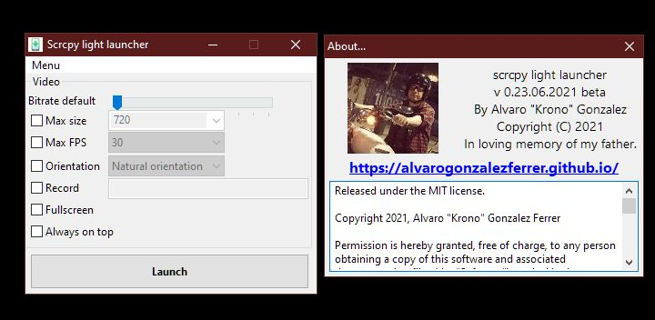
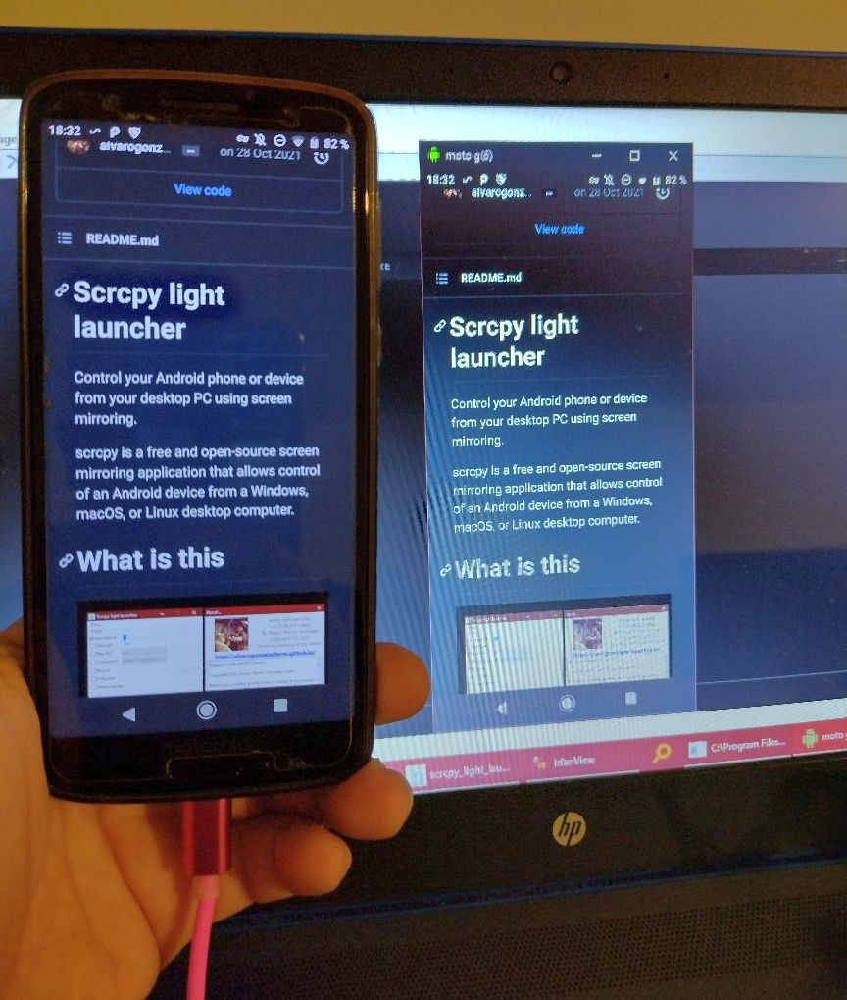

# Scrcpy light launcher

Control your Android phone or device from your desktop PC using screen mirroring.

scrcpy is a free and open-source screen mirroring application that allows control of an Android device from a Windows, macOS, or Linux desktop computer.

# What is this

This is a easy to use light launcher to control your android phone from a desktop PC.

I did this launcher because all the other tools were paid, or command line, or hard to use.

This is a very light, very fast, very easy and open source alternative.

I don't like bloated apps that depend on a million libraries to do simple things.

# License 

[Read the license to use here.](LICENSE.md)

# How to use

Download one of the releases pre-compiled for your system.

Just run the executable file and select the options.

This application provides display and control of Android devices connected on USB.

# Now with installer

For Windows 64 bits, I provided a installer, easy to use.

Just download and run it.

# Who am I?

Software developer, Computer Science graduate from Argentina.

Currently living at Costa Rica.

Check my portfolio for more info:

https://alvarogonzalezferrer.github.io/

There you can see my portfolio, I'm a freelancer, mainly expert in C++, you can hire me for your projects!

## Requirements

The Android device requires at least API 21 (**Android +5.0**).

**Make sure you enabled "adb debugging" on your device.**

On some devices, you also need to enable an additional option to control it using keyboard and mouse.

**VERY IMPORTANT ENABLE DEBUG ON YOUR DEVICE**

Enable adb debugging on your device as follows:

1. To use adb with a device connected over USB, you must **enable USB debugging** in the device system settings, under **Developer options**.

2. On Android 4.2 and higher, the Developer options screen is hidden by default.

3. To make it visible, go to **Settings > About** phone and tap Build number **SEVEN** times.

4. Return to the previous screen to find Developer options at the bottom.

NOTE: On some devices, the Developer options screen might be located or named differently.

**MOUSE AND KEYBOARD**

If Mouse and keyboard do not work:

On some devices, you may need to enable an option to allow simulating input.

In developer options, enable:

**USB debugging (Security settings)**

Allow granting permissions and simulating input via USB debugging

# How to compile

You need to use Lazarus IDE, https://www.lazarus-ide.org/

Should compile very easy, no weird dependencies.

# How it works

This launcher is based on scrcpy, https://github.com/genymobile/scrcpy/

Communication between the Android device and the computer is primarily performed via a USB connection and Android Debug Bridge (ADB).

The software functions by executing a server on the Android device, then communicating with the server via a socket over an ADB tunnel.

It does not require rooting or the installation of software on the Android device.

The screen content is streamed as H.264 video, which the software then decodes and displays on the computer. The software pushes keyboard and mouse input to the Android device over the server.

Setup involves enabling USB debugging on the Android device, connecting the device to the computer, and running the scrcpy application on the computer.

Access to more configuration options, such as changing the bit rate or enabling screen recording, is via a command-line interface.

The software also supports a wireless connection over Wi-Fi, but that requires more steps to set up.

A few features were added to scrcpy in its version 1.9 release in 2019, including the ability to turn the screen off while mirroring and to copy clipboard content between the two devices.

Chris Hoffman of How-To Geek compared scrcpy to AirMirror and Vysor, two other applications with a similar function. Hoffman also pointed to Miracast as an alternative, while noting that it is no longer widely supported among new Android devices, and that it does not support remotely controlling the device.
