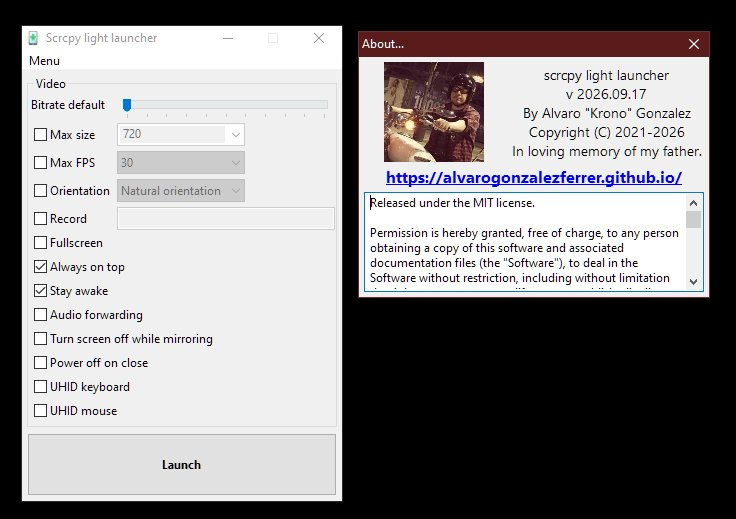
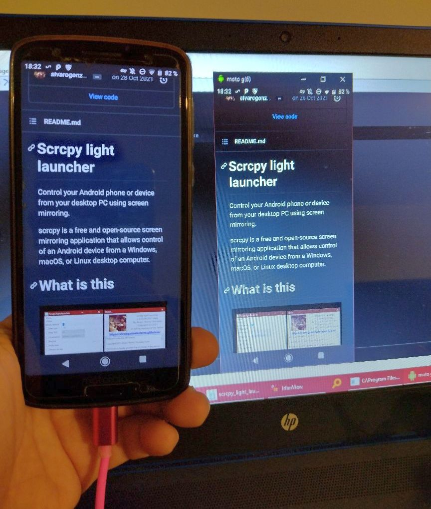
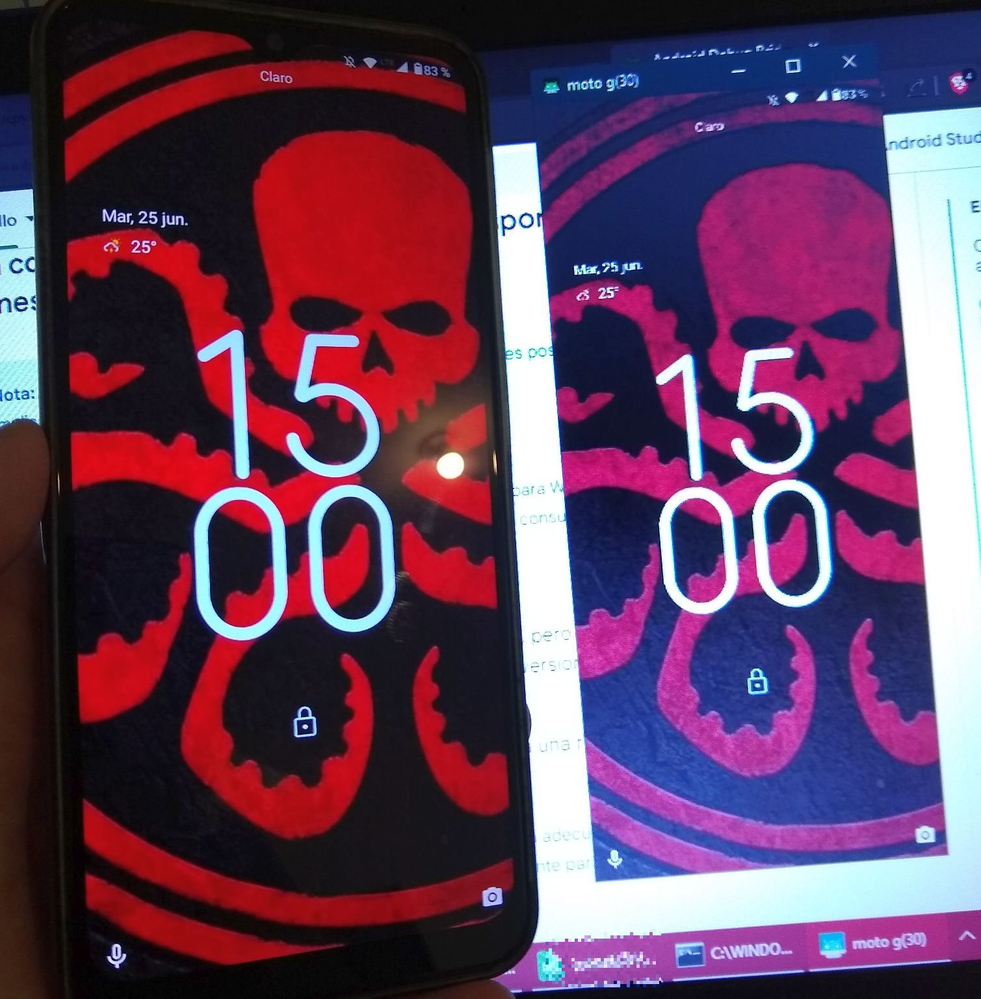

# Scrcpy Light Launcher

Control your Android phone or device from your desktop PC using screen mirroring.

scrcpy is a free and open-source screen mirroring application that allows control of an Android device from a Windows, macOS, or Linux desktop computer.

## What is this

This is an easy to use, light launcher to control your Android phone from a desktop PC.

I built this launcher because all the other tools were paid, command-line only, or hard to use.

This is a very light, very fast, very easy, and open source alternative.

I don't like bloated apps that depend on a million libraries to do simple things.

## Features

- Adjustable video bitrate
- Max resolution / max size limit
- Max FPS limit
- Lock video orientation
- Screen recording, with custom output file
- Fullscreen mode
- Always-on-top window
- Keep device awake while connected
- Disable audio forwarding
- Turn device screen off while mirroring
- Power off device on close
- UHID keyboard and mouse support
- Windows installer available, no extra runtime dependencies

## How to use

Download one of the [releases](../../releases) pre-compiled for your system.

Just run the executable file and select the options.

This application provides display and control of Android devices connected on USB.

### Windows installer

For Windows 64 bits, an installer is provided for easy setup.

**scrcpy itself is bundled inside the installer package** — there's nothing else to download. The bundled scrcpy build is updated to the latest available version each time a new installer package is generated.

Just download and run it.

## Requirements

The Android device requires at least API 21 (**Android 5.0** or higher).

**Make sure you enable USB debugging on your device** — this is required for the launcher to work.

On some devices, you also need to enable an additional option to control it using keyboard and mouse.

### Enabling USB debugging

1. To use adb with a device connected over USB, you must enable **USB debugging** in the device system settings, under **Developer options**.
2. On Android 4.2 and higher, the Developer options screen is hidden by default.
3. To make it visible, go to **Settings > About phone** and tap **Build number** seven times.
4. Return to the previous screen to find **Developer options** at the bottom.

Note: on some devices, the Developer options screen might be located or named differently.

### Mouse and keyboard not working?

On some devices, you may need to enable an extra option to allow simulating input.

In Developer options, enable:

**USB debugging (Security settings) → Allow granting permissions and simulating input via USB debugging**

## How it works

This launcher is based on [scrcpy](https://github.com/genymobile/scrcpy/).

Communication between the Android device and the computer is performed via a USB connection and Android Debug Bridge (ADB). The software runs a small server on the Android device and communicates with it via a socket over an ADB tunnel — no root access or app installation on the Android device is required.

The screen content is streamed as H.264 video, decoded and displayed on the computer. Keyboard and mouse input is pushed to the Android device through the same connection.

A wireless connection over Wi-Fi is also supported by scrcpy, though it requires a few extra setup steps not covered by this launcher yet.

## How to compile

You need [Lazarus IDE](https://www.lazarus-ide.org/).

It should compile very easily, with no unusual dependencies.

## Who am I?

Software developer, Computer Science graduate from Argentina.

Currently living in Costa Rica.

I'm a freelancer, mainly focused on C++ — check my portfolio for more info:

https://alvarogonzalezferrer.github.io/

**Available for hire — feel free to reach out for your projects.**

## License

This project is licensed under [LICENSE.md](LICENSE.md).